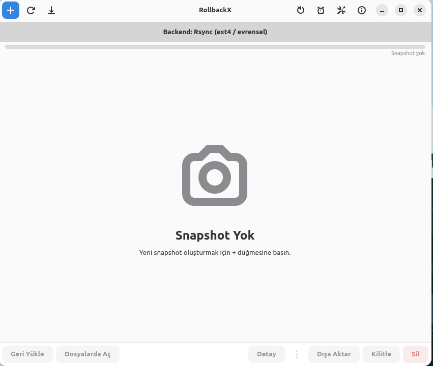
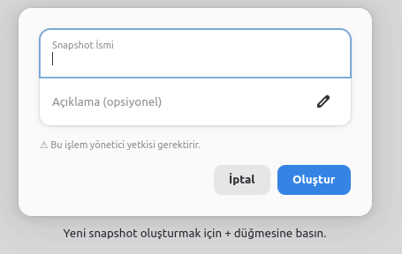
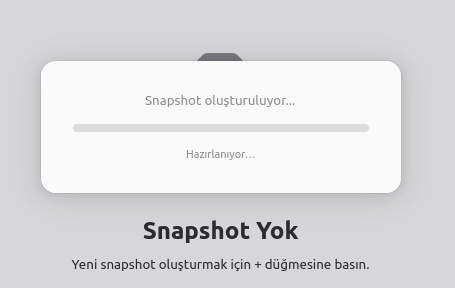
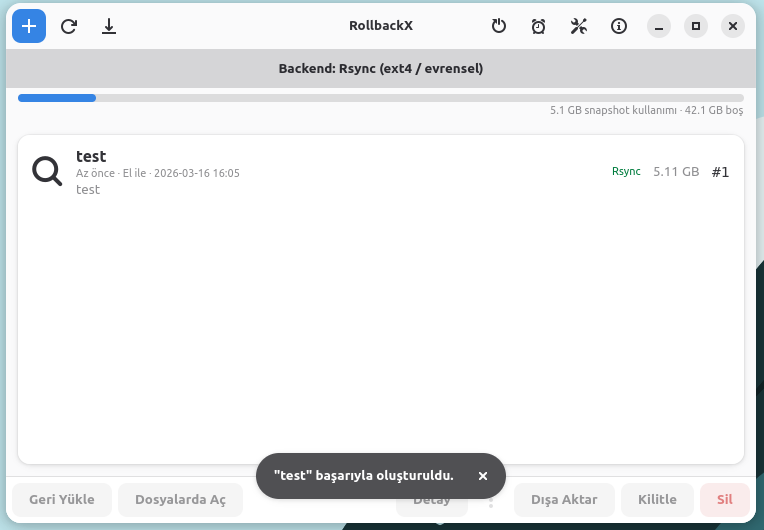
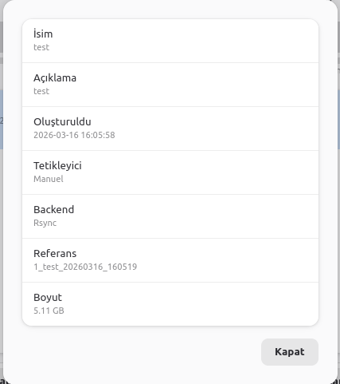
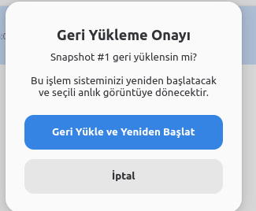
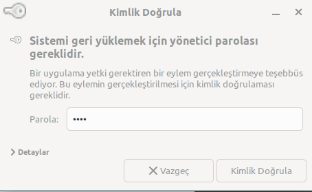
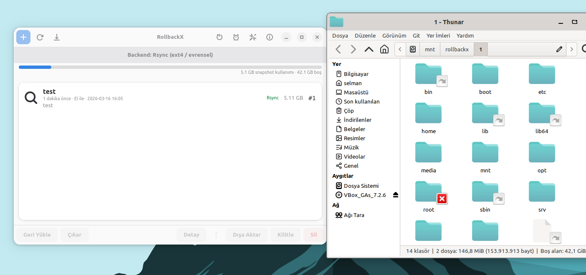

# RollbackX

**Pardus Linux için sistem durumu yöneticisi**

[](https://www.gnu.org/licenses/gpl-3.0)
[](https://www.rust-lang.org/)
[](https://www.pardus.org.tr/)
[](https://github.com/selmancuzdan42/rollbacktx/releases/latest)

RollbackX, Pardus ve diğer Debian tabanlı dağıtımlar için geliştirilmiş açık kaynaklı bir sistem durum yöneticisidir. Btrfs, LVM Thin ve Rsync depolama altyapılarını destekler; sistem yapılandırmasını otomatik algılayarak en uygun altyapıyı seçer.

---

## Kurulum

```bash
# 1. Paketi indir
wget https://github.com/selmancuzdan42/rollbacktx/releases/latest/download/rollbackx_1.0.0_amd64.deb

# 2. Kur
sudo dpkg -i rollbackx_1.0.0_amd64.deb
```

> Tüm sürümler için → [Releases](https://github.com/selmancuzdan42/rollbacktx/releases)

---

## Özellikler

- **Çok altyapı desteği** — Btrfs, LVM Thin Provisioning ve Rsync (ext4 dahil tüm dosya sistemleri)
- **Otomatik altyapı seçimi** — Btrfs → LVM Thin → Rsync öncelik sırasıyla algılama
- **APT entegrasyonu** — Her `apt install/upgrade/remove` işlemi öncesi otomatik durum kaydı
- **GRUB menüsü entegrasyonu** — Kayıtlı durumlardan doğrudan önyükleme
- **GTK4 / libadwaita arayüzü** — Modern, GNOME HIG uyumlu masaüstü uygulaması
- **CLI** — Türkçe/İngilizce çıktı (`ROLLBACKX_LANG=en`)
- **Rol tabanlı yetki modeli** — Admin / Öğretmen / Öğrenci modu (eğitim ortamları için)
- **Durum doğrulama** — Kritik sistem dosyalarının bütünlük kontrolü
- **Dışa/içe aktarım** — `.rxsnap` formatı ile arşivleme
- **systemd entegrasyonu** — Açılışta otomatik yükleme, zamanlanmış kayıt
- **Kilit mekanizması** — Kritik kayıtların yanlışlıkla silinmesini önler

---

## Ekran Görüntüleri

### Ana Ekran


### Yeni Kayıt Oluşturma
<p align="center">
  
  &nbsp;&nbsp;
  
</p>

### Kayıt Listesi


### Kayıt Detayı ve Geri Yükleme
<p align="center">
  
  &nbsp;&nbsp;
  
  &nbsp;&nbsp;
  
</p>

### Dosya Gezgini Entegrasyonu


---

## Kullanım

### CLI

```bash
# Yeni kayıt oluştur
sudo rollbackx snapshot create "güncelleme-öncesi"

# Kayıt listesi
rollbackx snapshot list

# Kayda dön (reboot gerektirir)
sudo rollbackx snapshot restore 3

# Sistem durumu
rollbackx durum

# Sistem kontrolü
rollbackx kontrol

# Kaydı doğrula
sudo rollbackx snapshot verify 3

# Kaydı dışa aktar
sudo rollbackx arsiv export 3 yedek.rxsnap

# İngilizce çıktı
ROLLBACKX_LANG=en rollbackx snapshot list
```

### GTK Arayüzü

```bash
rollbackx-gtk
```

Yönetici işlemleri otomatik olarak `pkexec` aracılığıyla yetkilendirilir; GTK uygulamasını root olarak çalıştırmaya gerek yoktur.

---

## Mimari

Proje 4 Cargo crate'inden oluşan bir Rust workspace olarak yapılandırılmıştır:

```
rollbackx/
├── crates/
│   ├── rollbackx-core      # İş mantığı: altyapılar, DB, hata türleri
│   ├── rollbackx-cli       # CLI binary (clap v4)
│   └── rollbackx-gtk       # GTK4/libadwaita masaüstü uygulaması
└── tests/                  # Entegrasyon testleri (loop device)
```

### Altyapı Öncelik Sırası

| Öncelik | Altyapı | Konum | Gereksinim |
|---------|---------|-------|------------|
| 1 | Btrfs | `/.snapshots/@{id}_{name}_{ts}` | Btrfs FS, btrfs-tools |
| 2 | LVM Thin | LV: `rx_{id}_{name}` | LVM Thin pool, lvm2 |
| 3 | Rsync | `/var/lib/rollbackx/snapshots/` | rsync (evrensel) |

### Sistem Entegrasyonu

| Bileşen | Açıklama |
|---------|----------|
| `apt-hook/80rollbackx` | Her APT işlemi öncesi otomatik kayıt |
| `rollbackx-restore.service` | Açılışta otomatik yükleme |
| `rollbackx-cmdline.service` | GRUB kernel parametresi ile yükleme |
| `rollbackx-schedule.timer` | Periyodik otomatik kayıt |
| `grub.d/80_rollbackx` | Kayıtları GRUB menüsüne ekler |
| `polkit/org.rollbackx.policy` | pkexec yetkilendirme politikası |

---

## Katkıda Bulunma

1. Bu repoyu fork edin
2. Feature branch oluşturun (`git checkout -b ozellik/yeni-ozellik`)
3. Değişikliklerinizi commit edin (`git commit -m 'feat: yeni özellik ekle'`)
4. Branch'i push edin (`git push origin ozellik/yeni-ozellik`)
5. Pull Request açın

---

## Lisans

Bu proje [GNU General Public License v3.0](LICENSE) ile lisanslanmıştır.

---

## İletişim

**Geliştirici:** Selman F. CÜZDAN
**GitHub:** [@selmancuzdan42](https://github.com/selmancuzdan42)
